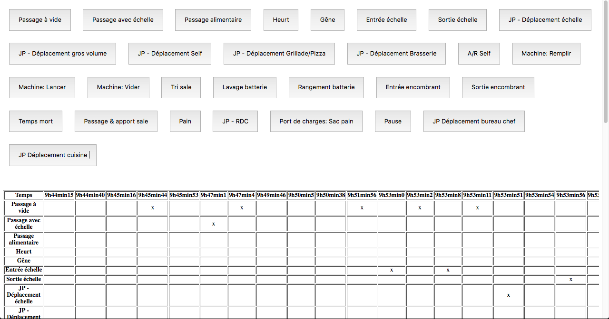
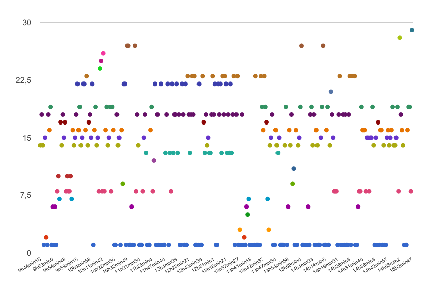

Dans le cadre d'observations systématiques, les ergonomes ont parfois besoin de relever les actions d'un opérateur, dans des conditions liées à l'activité de l'observé (déplacements, posture debout, enchainement rapide d'actions…). Si actuellement la norme est de constituer des grilles d'observations représentant un tableau où l'on peut cocher les actions selon le temps, la possibilité de tirer parti du numérique pour faciliter ce processus m'a semblé évidente. En effet, le relevé papier est complexe, nécessitant de pouvoir à la fois noter les actions, vérifier l'heure, sans perdre de vue l'activité de celui qui travaille et qui enchaine parfois de nombreuses taches en quelques minutes.

Cette application web est donc une version alpha mais apporte de nombreuses améliorations aux besoins des ergonomes dans des conditions d'observations systématiques (support unique plutôt que papier, crayon, montre; rapidité pour relever les actions; accessible sur ordinateur comme tablette, ce qui amène plus de mobilité) et leur permet de se concentrer pleinement sur l'activité de l'opérateur.

<figure>
  
</figure>

Pour un rendu rapide, le graphique résulte d'un export du tableau sur GoogleCalc puis d'une création de graphique. A terme, il est prévu de créer le graphique à partir de l'application puisque les technologies web amènent des avantages en lecture de données (par exemple, au survol d'un point, sa nature et son heure pourront être affichés).

<figure>
  
</figure>

Parmis les améliorations prioritaires:
- Création de graphe,
- Groupe d'observables,
- Bouton pour une plage de temps indéterminée,
- Bouton à plage de temps prédéfinie,
- Boutons interdépendants: un des boutons du groupe doit forcément être enclenché durant l'observation (utile pour les positions assis/debout par exemple)
