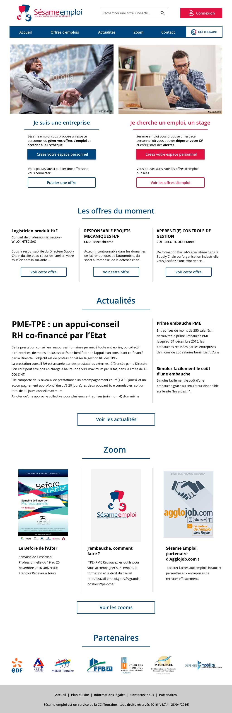

Sésame emploi est une plateforme permettant de rechercher ou proposer des offres d’emploi pour les départements du Cher, de l'Indre et de la Touraine.

Au sein de l'agence Occitech, en réponse à leur appel d’offre pour une refonte responsive, j’ai réalisé des maquettes de leur page d’accueil en repensant l’architecture d’information et l’aspect graphique des différentes parties.

# Version mobile

<figure>
  
  <figcaption> Maquette mobile de l'accueil </figcaption>
</figure>

# Version desktop

<figure>
  
  <figcaption> Maquette desktop de l'accueil </figcaption>
</figure>
